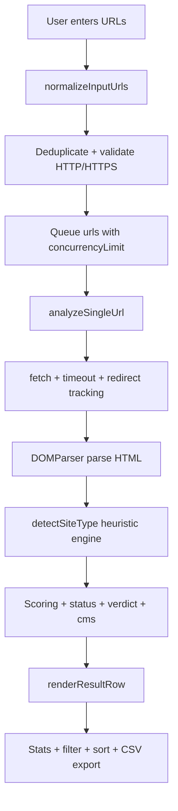

# Site Analyzer

A high-signal, browser-based website auditing toolkit that classifies URL health, content maturity, and probable platform/CMS in a single scan.

[](https://chromewebstore.google.com/search/OstinUA)
[](https://ostinua.github.io/Chrome-Web-Store_Developer-List/)

[](manifest.json)
[](manifest.json)
[](LICENSE)
[](src/app.js)

> [!NOTE]
> This project is implemented as a Chrome extension popup workflow (not a backend API service) and is optimized for analyst-driven, manual scan sessions.

## Table of Contents

- [Title and Description](#site-analyzer)
- [Table of Contents](#table-of-contents)
- [Features](#features)
- [Tech Stack & Architecture](#tech-stack--architecture)
- [Getting Started](#getting-started)
- [Testing](#testing)
- [Deployment](#deployment)
- [Usage](#usage)
- [Configuration](#configuration)
- [License](#license)
- [Contacts & Community Support](#contacts--community-support)

## Features

- Batch URL scanning via multiline input (`1 URL per line`) with duplicate-safe normalization.
- Concurrency-aware execution queue for fast bulk analysis while controlling browser-side pressure.
- Request timeout handling with deterministic error verdicts for slow or unreachable hosts.
- HTTP/error awareness:
  - Explicit handling for `401`, `403`, `404`, and `5xx` categories.
  - Redirect detection (`response.url`) surfaced in UI.
- Multi-signal website classification engine:
  - Parked/for-sale domain detection via title/body/canonical/known-domain heuristics.
  - Under-construction and blocked-page pattern detection.
  - Content quality scoring for full-site vs landing-page differentiation.
- CMS/framework fingerprinting support (e.g., WordPress, Shopify, Wix, React, Vue, Angular, Magento, Bitrix, and more).
- Content and structure metrics:
  - Internal links
  - Navigation links
  - Word count
  - Images
  - Complexity score (`scripts + styles + forms`)
- Interactive data table with sortable metric columns.
- Full-text client-side filter by URL/title and status-severity filters.
- CSV export for analyst handoff/reporting workflows.
- Theme persistence (`light`/`dark`) via `localStorage`.
- Recheck workflow via row double-click to quickly refresh a single site result.

> [!TIP]
> Use the filter dropdown immediately after large scans to triage `error` and `danger` rows first; this yields the highest investigation ROI.

## Tech Stack & Architecture

### Core Stack

- Language: `JavaScript (ES Modules)`
- Runtime surface: `Chrome Extension Manifest V3`
- UI: `HTML + CSS + Vanilla JS`
- Browser APIs: `chrome.action`, `chrome.windows.create`, `fetch`, `DOMParser`
- Packaging: static extension assets (`manifest.json`, popup page, service worker)

### Project Structure

<details>
<summary>Expand repository tree</summary>

```text
Site-Analyzer/
├── background.js
├── LICENSE
├── manifest.json
├── popup.html
├── popup.js
├── styles/
│   └── popup.css
├── icons/
│   └── icon128.png
└── src/
    ├── analyzer.js
    ├── app.js
    ├── constants.js
    ├── dom-utils.js
    └── url-utils.js
```

</details>

### Key Design Decisions

- **Module boundaries are explicit**: URL normalization, analysis, constants, and DOM rendering are split into focused modules.
- **Heuristic-first classification**: signals are weighted and composed rather than relying on brittle single-pattern detection.
- **Client-only execution model**: keeps deployment trivial and avoids backend operating cost.
- **Progressive rendering**: each completed URL updates the table immediately for faster analyst feedback loops.

<details>
<summary>Architecture and scan pipeline (Mermaid)</summary>



</details>

> [!IMPORTANT]
> Classification is heuristic by design. Treat verdicts as high-quality triage signals, not legal/compliance truth.

## Getting Started

### Prerequisites

- `Google Chrome` (or Chromium-based browser with MV3 extension support)
- Local filesystem access to load unpacked extension
- Optional: `Node.js >= 18` for local static checks (syntax/lint workflows)

### Installation

1. Clone the repository:

   ```bash
   git clone https://github.com/<your-org>/Site-Analyzer.git
   cd Site-Analyzer
   ```

2. Open extension management in Chrome:
   - Navigate to `chrome://extensions/`
   - Enable `Developer mode`

3. Load extension:
   - Click `Load unpacked`
   - Select the project root folder

4. Launch analyzer:
   - Click the extension icon in the toolbar
   - The extension opens `popup.html` in a popup window

<details>
<summary>Troubleshooting and alternative local workflows</summary>

### Common issues

- **Extension does not open popup window**
  - Reload the extension in `chrome://extensions`
  - Check `background.js` is present and valid.

- **Some URLs consistently fail with CORS/unavailable verdicts**
  - This is expected for some hosts due to browser constraints or anti-bot policies.

- **No results appear after pressing scan**
  - Verify URLs are valid and include resolvable hostnames.
  - Invalid lines are skipped by normalization.

### Alternative verification checks

Use a lightweight syntax validation pass before loading unpacked:

```bash
node --check background.js
node --check popup.js
node --check src/constants.js
node --check src/url-utils.js
node --check src/dom-utils.js
node --check src/analyzer.js
node --check src/app.js
```

</details>

## Testing

This repository currently does not include a dedicated automated test harness. Recommended local quality gates:

- JavaScript syntax checks:

  ```bash
  node --check background.js
  node --check popup.js
  node --check src/constants.js
  node --check src/url-utils.js
  node --check src/dom-utils.js
  node --check src/analyzer.js
  node --check src/app.js
  ```

- Manual functional verification in Chrome:
  1. Load unpacked extension.
  2. Paste a mixed set of reachable/unreachable URLs.
  3. Verify verdict distribution, progress updates, sorting/filtering, CSV export, and row recheck.

> [!WARNING]
> In-browser behavior can differ across domains due to rate limiting, anti-bot middleware, geo rules, and transient transport errors.

## Deployment

### Production Distribution (Chrome Extension)

- Increment version in `manifest.json`.
- Package extension source as a zip artifact (excluding local editor/system files).
- Upload via Chrome Web Store Developer Dashboard (or distribute internally as unpacked/enterprise policy extension).

### CI/CD Integration Guidelines

- Add a pipeline stage for syntax checks (`node --check ...`).
- Add static linting (e.g., ESLint) to enforce code conventions.
- Add artifact packaging step (`zip`) tied to tagged releases.
- Gate releases by manifest versioning policy and optional changelog checks.

<details>
<summary>Example packaging commands</summary>

```bash
# from repository root
zip -r site-analyzer.zip manifest.json background.js popup.html popup.js styles src icons LICENSE README.md
```

</details>

## Usage

### Basic Usage

```text
1) Open the extension popup window.
2) Paste URLs, one per line.
3) Click "Start Scan".
4) Watch progressive table updates.
5) Filter/sort results and export CSV.
```

```js
// Example URL input (one per line)
example.com
https://shop.example.org
https://expired-or-empty-domain.tld
```

### Result Semantics

- `success`: likely complete websites (`✓ Full website`, `✓ E-commerce store`, `✓ Blog / Media`)
- `warning`: likely partial/minimal sites (`~ Landing`, `~ Minimal`, `Under construction`)
- `danger`: parked/empty/broken content states
- `error`: access/network/time-out/system errors

<details>
<summary>Advanced Usage: triage strategy, custom workflows, and edge cases</summary>

### Advanced triage strategy

- Sort by `Score` descending to inspect high-confidence production websites first.
- Filter to `danger` and `error` for remediation workflows.
- Review `HTTP`, `Time`, and `Verdict` jointly to separate transport failures from content-quality issues.

### Custom formatter workflow for downstream systems

If your downstream pipeline expects canonical category labels, transform CSV exports with a post-processing script:

```js
// pseudo-map for BI ingestion
const statusMap = {
  success: 'ACTIVE',
  warning: 'PARTIAL',
  danger: 'INACTIVE',
  error: 'UNREACHABLE'
};
```

### Edge cases

- Heavy SPA sites may produce weak initial semantic signals if content requires client-side hydration.
- Some pages intentionally block bot-like fetch signatures and will appear as `Blocked / 403` or network errors.
- CMS detection is marker-based and may miss heavily customized deployments.

</details>

## Configuration

Runtime defaults are maintained in `src/constants.js` and consumed by the app/analyzer modules.

- `concurrencyLimit`: max parallel URL workers.
- `timeoutMs`: request timeout used by abort controller.
- `titleMaxLength`: max rendered title length in result table.
- `themeStorageKey`: localStorage key for theme persistence.

<details>
<summary>Configuration reference table and defaults</summary>

| Key | Type | Default | Description |
|---|---|---:|---|
| `concurrencyLimit` | `number` | `5` | Limits in-flight scan workers. |
| `timeoutMs` | `number` | `15000` | Abort threshold per URL request in milliseconds. |
| `titleMaxLength` | `number` | `40` | Truncation threshold for page title rendering. |
| `themeStorageKey` | `string` | `siteAnalyzerTheme` | Storage key used by UI theme toggle logic. |

### Example constant object

```js
export const DEFAULTS = {
  concurrencyLimit: 5,
  timeoutMs: 15000,
  titleMaxLength: 40,
  themeStorageKey: 'siteAnalyzerTheme'
};
```

### Environment variables

This project currently has no required `.env` variables and no CLI startup flags.

</details>

> [!CAUTION]
> Increasing `concurrencyLimit` too aggressively can reduce result quality due to host throttling and temporary network failures.

## License

This project is licensed under the `MIT License`. See [`LICENSE`](LICENSE) for the full text.

## Contacts & Community Support

## Support the Project

[](https://www.patreon.com/OstinFCT)
[](https://ko-fi.com/fctostin)
[](https://boosty.to/ostinfct)
[](https://www.youtube.com/@FCT-Ostin)
[](https://t.me/FCTostin)

If you find this tool useful, consider leaving a star on GitHub or supporting the author directly.
